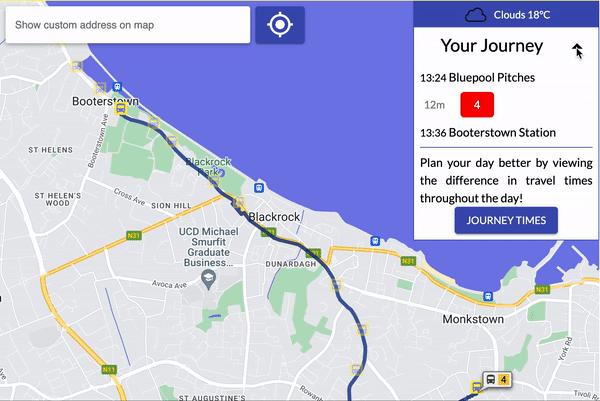

# **BusMe! - A Dublin Bus Journey Planner**

## **What is BusMe?**
---
BusMe is a Dublin Bus journey planner. It is a web application that predicts bus journey times in Dublin City using machine learning models. 

## **How do I use BusMe?**
---
### Planning a Journey

#### Control Panel
The control panel allows the user to select a route, two stations along this route, as well as desired time of departure from the first station or a time of arrival at the last station. All three inputs support autocomplete, allowing the user to search for a route or station, as well as scrolling through the available options.

    

By default, the application offers journey planning on single routes. Multi-route mode removes this requirements, allowing users to plan their journey between any two stations on the map. This mode was designed with users unfamiliar to the city in mind or those with longer commutes through or outside the city center.

    

#### Viewing Route on the Map
If no route is selected, all stations within the vicinity of the current zoom level are shown. Once a route has been selected, the map zooms out to show the entire trajectory of the route, giving visual feedback about whether they've selected the correct route. This also allows user unfamiliar with the city to see where a particular route travels to.

    

Once a start station is selected, the stations before it turn opaque. This both shows the user the potential remaining destination stations and the direction they’re travelling in, allowing them to change direction if they've made a mistake. Once a destination is selected, all markers except the start and destination stations become opaque. The decision was made to not have the markers disappear completely, so that users can change their start and end stations from the map, if desired.

    

#### Planning Journey with Info Windows
Attached to each marker is an info window which enables the user to plan journeys from the viewpoint of each station. The info window displays a station’s name, number, and routes that pass through that station.  Users can also plan their journey directly from each station marker on the map. Designed for users who are unfamiliar with city, this allows for the start and end station along a route to be judged more intuitively.

    

#### Using Geolocation
At the top of the map, a geolocation button can be pressed that pans the map to the user’s location (browser permissions required). They can then access local stations directly from the map and begin planning their journeys.

    

#### Panning to a Location
A search bar just above the map connects to the Google Maps Places API, providing dropdown suggestions of addresses around the city. When an address is selected, the map pans to this location. A user can then find stations in this area and begin planning their journey using the info windows.

    

### Viewing a Journey

#### Displaying the Route on the Map
Once the Plan Journey button has been clicked, the map retrieves route directions from the Google Maps Directions API. The route returned is rendered as a polyline.

    

#### Journey Panel

A panel overlayed to the right of the map presents the departure time and arrival time at each station, as well as a predicted travel time returned by BusMe's predicted travel times API.

    

As the application will be used by commuters, it was important that all features worked well on mobile devices. While breakpoints worked well for most features, the journey panel continued to block much of the map, even when it had been condensed. To address this, a hide button was added that collapses the journey panel to a card-like format. The user can also choose to show the information again, if they want to see their planned journey.

    

#### Journey Time Analytics

There’s nothing worse than being stuck in traffic on public transport. In the Journey Panel, the user can see the journey times for a 4-hour window around the journey they've planned. This gives them the option of planning their work commute earlier or later to make their journey more pleasant.

    

*Icon Credit: https://github.com/alexandresanlim/Badges4-README.md-Profile*

**END**
